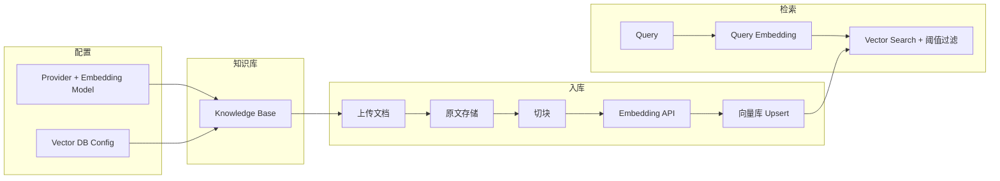

# 知识库 RAG 全流程开发计划

本文档描述 BuildTest AI 在 **Phase 1** 及与后续里程碑衔接下，知识库从「配置与入库」到 **Naive 向量检索** 的端到端技术方案与落地顺序。产品与技术约束以仓库根目录 `build-test-ai.md` 为准；实现过程中若发现文档滞后，应先更新该文档再改代码。

---

## 1. 设计核心：优先回答「怎么切」与「怎么查」

RAG 知识库的设计重心**不在于「存了什么文件」**，而在于 **切分（chunking）是否尊重语义边界**、**元数据是否支撑可追溯召回**，以及 **检索链路是否在「少而准」与「不漏关键句」之间取得平衡**。盲目堆砌文档、固定长度随意截断，会让上下文充满噪声，模型表现往往弱于不加知识库的通用回答；反之，架构良好的知识库能显著提升事实性与可解释性。

业界共识（2025–2026）：**数据质量决定上限**（「垃圾进，垃圾出」）；**切片是最容易忽视、却对效果影响最大的工程环节**；**检索不是召回越多越好**，需要与重排、评测与迭代闭环结合。下文按四个层次归纳主流实践，并标注在本仓库里程碑中的落点，避免与 Phase 1 的 Naive RAG 边界混淆。

### 1.1 第一层：数据处理与切片策略

| 维度 | 核心策略（行业实践） | 在本平台的落点 |
| :--- | :--- | :--- |
| **文档解析** | 按复杂度分层选型：日常 Office 可考虑 Unstructured 等管线；复杂 PDF（表格/公式/多栏）倾向 Marker、MinerU 等；表格/版式密集可考虑 Docling 等 | **Phase 1**：以 `build-test-ai.md` 附录 A.2 为准（TXT/MD/PDF/DOCX 与轻量 loader），先跑通闭环；**后续**：按文档画像（见 1.6）为「解析器插件化」预留接口，避免把某一厂商 SDK 写死在业务层 |
| **切片粒度** | **语义边界优先于固定字符数**；在段落、标题、表格、代码块等自然边界处切分；**滑动窗口重叠**（常见约 10–20% 重叠）降低「关键句被拦腰截断」的概率 | **Phase 1**：`chunk_size` / `chunk_overlap` 可配置，默认与 A.2 的 `RecursiveCharacterTextSplitter` 思路一致；**演进**：Parent-Document、句子窗口等见 `build-test-ai.md` Phase 1 补充中的索引结构类能力 |
| **元数据增强** | 每个切片保留 **来源文档、页码/章节、标题层级**；**标题链**（如 `# 手册 > ## 安装 > ### 第一步`）写入 payload，便于过滤、展示与相关性 | **向量库 payload** 与关系库 **血缘** 对齐：`document_id`、`chunk_index`、可选 `heading_path`、`page`（PDF）、`source_uri`；前端试检索与 Phase 2 的 `retrieved_context` 展示均依赖此结构 |

### 1.2 第二层：索引与存储架构

| 设计要点 | 行业常见做法 | 在本平台的落点 |
| :--- | :--- | :--- |
| **向量库选型** | 原型期轻量方案与生产级可扩展方案并存；生产多见 Qdrant、Milvus、云托管向量索引等 | 与 `vector_db_configs` 及 `frontend/lib/vector-db-catalog.ts` 一致；**Phase 1 实现优先级**：`postgres_pgvector` → `qdrant`（见 `build-test-ai.md` 附录 A.15） |
| **索引类型** | 数据量增大后使用 **HNSW** 等近似索引，控制延迟 | **pgvector**：按规模选 HNSW / IVFFlat；**Qdrant**：按官方建议配置向量索引；MVP 可先用默认，在性能里程碑专项调参 |
| **混合存储** | **热数据**（高频检索）在向量库；**冷数据**（历史版本、归档）在对象存储降本 | **Phase 1**：原文以 volume 或等价本地存储为主（见下文 §5）；**生产演进**：S3 兼容对象存储 + 生命周期策略，与 KB 元数据中的 `storage_key` 关联 |
| **内容寻址与增量** | 对切片内容做 **SHA-256** 等指纹，用于「仅重处理变更切片」、去重与可重复构建 | **建议纳入后续迭代**：payload 或侧表存 `content_hash`；`rebuild` 与文档更新时做 diff，减少重复 Embedding 成本（与 Celery 异步化后的队列友好） |

### 1.3 第三层：检索策略与重排序

| 策略 | 机制与解决的问题 | 在本平台的落点 |
| :--- | :--- | :--- |
| **稠密检索（Naive）** | Query embedding + Top-K + 相似度阈值；解决「语义相关」的大头召回 | **Phase 1 必须交付**；参数与 A.2 对齐，知识库级可覆盖（见 §3 字段建议） |
| **混合检索** | 向量 + **关键词**（BM25 等），**RRF** 等融合，兼顾「手机发烫」类语义与「iPhone 15 Pro」等精确词 | **刻意不在 Phase 1 做**；见 `build-test-ai.md` Phase 3（Hybrid） |
| **重排序** | 粗召回到 Top 20–50 后，用 **Cross-Encoder** 等精排，再取 3–5 条进 LLM | **Phase 3**；连接器与评测管线预留「多段上下文 + 分数轨迹」即可 |
| **查询意图 / 改写** | 对模糊问句做改写或意图分类，再检索 | **Phase 2 起**可与 Playground / 评测 query 侧编排结合；与 `build-test-ai.md` 中「仅查询侧、不改索引」类演进顺序一致 |

### 1.4 第四层：持续迭代与运维闭环

| 机制 | 实践要点 | 在本平台的落点 |
| :--- | :--- | :--- |
| **量化评估** | 检索侧 MRR、Recall@K 等；生成侧事实性、幻觉率等 | **Phase 2 评测中心**：同一数据集多次 job、持久化 `retrieved_context` 与分数，支撑对比与 Bad Case（产品核心差异化，见 `CLAUDE.md`） |
| **Prompt 约束** | 系统提示中要求 **严格依据参考文档**，无法覆盖时明确拒答 | **Phase 2** Prompt 模板与评测 judge；Phase 1 可在试检索 UI 用固定提示文案做演示级约束 |
| **人机协同** | 高风险域人工复核、标注回流 | 与评测标注、Bad Case 工作流衔接，属 **Phase 2+** 产品能力 |
| **版本与时态** | 法规/合同类文档在元数据中维护 **生效时间**，支持「某时点有效」的检索过滤 | **建议在 payload / 文档表预留** `valid_from` / `valid_to`（可空）；检索 API 后续增加时间过滤条件 |

### 1.5 文档画像与解析方案（落地前的输入）

不同语料适用的解析栈差异很大，**上架知识库前**建议采集用户侧画像，用于路由解析器与切块预设：

| 画像 | 典型语料 | 解析与切块侧重 |
| :--- | :--- | :--- |
| A. 标准化可编辑文档 | Word、文本型 PDF、Markdown | Phase 1 默认链路即可较快达标；侧重标题链元数据 |
| B. 复杂版式 / 表格 / 公式 | 论文、技术手册、财报 | 优先评估 MinerU / Marker / Docling 等，表格单独成块或表格摘要策略 |
| C. 扫描件 / 影印 PDF | 无文本层 | OCR（如专用 OCR 管线）前置，再进入切块；质量门禁与人工抽检成本更高 |

平台侧不必在 Phase 1 接齐所有工具，但 **ingest 管线应保持「解析 → 结构树 → 切块 → 向量」的分层**，以便按画像插拔解析器而不推翻存储模型。

---

## 2. 目标与边界

### 2.1 Phase 1 必须跑通的闭环

1. 用户具备 **Provider（含 Embedding 模型）** 与 **向量库配置**（`vector_db_configs`，且 `postgres_pgvector` / `qdrant` 可测通）。
2. 创建 **知识库**：绑定 `vector_db_config_id`、`embedding_model_id`，切块参数（`chunk_size` / `chunk_overlap`）可配置。
3. **上传文档** → 持久化原文与元数据 → **切块** → **调用 Embedding** → **写入向量库**（经统一连接器，禁止业务层硬编码单一厂商）。
4. 提供 **Naive 检索**：query 向量化后按余弦或库默认度量做 Top-K，支持 **知识库级** 覆盖 `top_k`、**相似度阈值**（与附录 A.2 默认值语义一致：默认 `top_k=5`、`similarity_threshold=0.7`）。
5. 文档状态可追踪：`pending` → `processing` → `completed` / `failed`，失败可展示原因（建议表字段 `error_message` 或等价物）。

### 2.2 Phase 1 刻意不做（避免范围蔓延）

- Hybrid（稀疏 + 稠密）、cross-encoder rerank、图检索、多步 Agent 检索编排（见 `build-test-ai.md` Phase 1 补充与 Phase 3 规划）。
- 评测任务、Prompt 模板、数据集血缘（Phase 2）；此处仅保证 **向量侧数据与元数据** 可被后续 `evaluation_results.retrieved_context` 消费。

### 2.3 推荐技术栈（与仓库现状对齐）

| 环节 | 选型建议 |
| :--- | :--- |
| 编排与 API | FastAPI，路由前缀 `/api/v1`；多租户 `user_id` 在 Repository 层强制过滤 |
| 关系库 | PostgreSQL + SQLAlchemy 2 + Alembic |
| 异步队列 | Phase 1 Embedding 允许 **同步** 处理（文档中已说明，代码中保留 TODO 切 Celery） |
| 切块 | LangChain `RecursiveCharacterTextSplitter` 或等价轻量实现；按文件类型分派 loader（A.2） |
| 向量库 | 抽象 `VectorDbConnector`：`upsert`、`delete_by_document`、`search`；Phase 1 实现 **postgres_pgvector** 与 **qdrant** |
| 前端 | Next.js BFF 透传 `/api/backend/*`；数据请求 TanStack Query；表单 react-hook-form + zod |
| 类型契约 | 后端 OpenAPI → `pnpm gen:api-types` |

---

## 3. 端到端数据流（概念）



**血缘要点**：`documents` 与向量库中的 point id / row 应能通过 `(knowledge_base_id, document_id, chunk_index)` 或 payload 中的稳定字段关联，便于删除文档时级联清理向量与后续评测 diff。

---

## 4. 数据模型与迁移（优先于业务代码）

建议在单条或少量 Alembic 迁移中一次到位（与 `build-test-ai.md` 附录 A.3、A.14 对齐）：

| 实体 | 要点 |
| :--- | :--- |
| `knowledge_bases` | `user_id`；`name` / `description`；`vector_db_config_id`；`embedding_model_id`；`chunk_size` / `chunk_overlap`；**`embedding_dimension`**（**冗余自 `models.vector_dimension`，刻意保留作"维度锁"**：模型被替换或上游维度变化时能检测到不匹配并阻断写入）；**`retrieval_top_k`**、**`retrieval_similarity_threshold`**（默认 5 / 0.7，与 A.2 一致）；**`retrieval_config` JSONB**（预留策略版本 / `distance_metric` / rerank 配置等扩展位）；**`collection_name`** 由服务端生成并落库：`kb_{knowledge_base_id的无连字符hex}_{embedding_dimension}`（在 pgvector 单表策略下仅用于日志/路由标识，不作为表名；见 §5.4）；**`deleted_at`** |
| `documents` | `knowledge_base_id`；`file_name` / `file_type` / `file_size`；`status`；`chunk_count`；**`error_message`**（`status=failed` 或向量侧清理失败时写入）；**`deleted_at`**；可选 `storage_path` 或 `storage_key` 指向原文 |

**约束与校验**：

- 创建 KB 时校验：`embedding_model.model_type == embedding`；`vector_db_config` 归属同一 `user_id`。
- 切换 embedding 模型若 **维度变化**：必须提示重建 collection（可 Phase 1 直接 **禁止更新 embedding_model_id** 若已有文档，或提供「清空重建」显式操作）。

---

## 5. 后端分层与模块切分

### 5.1 API 层（薄）

与 `build-test-ai.md` §4.4 对齐，并 **补充检索**（前文档缺口，本计划显式纳入）：

| 方法 | 路径 | 说明 |
| :--- | :--- | :--- |
| GET/POST | `/knowledge-bases` | 列表、创建 |
| GET/PUT/DELETE | `/knowledge-bases/{id}` | 详情、更新、软删 |
| GET/POST | `/knowledge-bases/{id}/documents` | 列表、上传（multipart） |
| DELETE | `/knowledge-bases/{id}/documents/{doc_id}` | 软删 + 同步清理向量（失败写 `documents.error_message`，不回滚软删，由 rebuild 修复） |
| POST | `/knowledge-bases/{id}/rebuild` | 全量或按文档重建索引（Phase 1 按文档粒度）；重建期间该文档 `status=processing`，检索侧仍按旧向量返回（允许短暂不一致） |
| POST | `/knowledge-bases/{id}/retrieve` | Naive 检索：body 含 `query`，可选覆盖 `top_k` / `similarity_threshold`；**同步返回，不产生 task id**。后续若接 hybrid / rerank，在同一 URL 扩展请求体，不另开路径 |

可选：与 §4.5 统一的 `POST /embedding/process` 在 Phase 1 **不暴露**（上传后自动同步处理）；Phase 3 切 Celery 后再启用，用于"触发 / 查询"解耦场景。

### 5.2 Service 层（厚）

建议独立服务（命名示例）：

- `KnowledgeBaseService`：CRUD、collection 懒创建、检索参数默认值。
- `DocumentIngestService`：保存文件、更新状态机、调切块与 embedding、调 `VectorDbConnector.upsert`。
- `EmbeddingClient`：封装对 Provider 的 embedding 调用（限流、重试见全局规范）；单测对外部 API 使用 VCR 或 mock。

### 5.3 Repository 层

- 所有查询带 `user_id`；软删默认 `deleted_at IS NULL`。
- 删除 KB 前检查引用关系（若 Phase 2 会有 evaluation 引用，可预留注释或外键策略）。

### 5.4 向量连接器（核心抽象）

接口建议（示意）：

```text
class VectorDbConnector(Protocol):
    async def ensure_collection(
        self, name: str, vector_size: int, distance: Literal["cosine", "l2", "dot"] = "cosine"
    ) -> None: ...
    async def upsert_chunks(self, collection: str, items: list[VectorChunk]) -> None: ...
    async def delete_by_document(self, collection: str, document_id: UUID) -> None: ...
    async def search(
        self,
        collection: str,
        query_vector: list[float],
        top_k: int,
        score_threshold: float | None,
        filters: dict | None = None,   # 至少支持 knowledge_base_id 过滤,pgvector 单表策略必传
    ) -> list[SearchHit]: ...
```

- **postgres_pgvector**：采用 **单物理表 + `knowledge_base_id` 列过滤** 策略（不按 KB 建表,避免 UUID 含 `-` 导致的表名清洗与迁移复杂度）；每行 payload 至少含 `knowledge_base_id` / `document_id` / `chunk_index` / `text`；检索 SQL 必带 `WHERE knowledge_base_id = :kb_id`，**跨租户隔离靠该谓词 + Repository 层 `user_id → kb_id` 映射联合保证**；索引 MVP 用默认 B-Tree + vector index(HNSW/IVFFlat 按规模在"性能专项"里程碑调参);`CREATE EXTENSION IF NOT EXISTS vector` 已在 docker-compose 的 postgres 镜像启动时自动执行。
- **qdrant**：每个 KB 一个 collection（Qdrant collection 名允许字母/数字/连字符/下划线，直接用 `collection_name` 即可）；payload 携带 `knowledge_base_id` / `document_id` / `chunk_index` / `text` 片段等;payload 索引按需建立以支持 filters。
- **content_hash(建议 Phase 1 即纳入)**：payload 或侧表增加 `content_hash`(切片文本 SHA-256),`upsert` 前比对可省掉未变更切片的 embedding 调用——Phase 1 引入成本极低,收益显著;与 Celery 异步化后的增量重建策略直接衔接。

**工厂**：根据 `vector_db_configs.db_type` 与解密后的连接信息实例化连接器；与现有 `vector_db_probe` 共用解密与类型分派逻辑，避免两套连接代码。

### 5.5 原文存储（需在实现时选定并写进部署说明）

| 方案 | 适用 |
| :--- | :--- |
| 本地 volume（Docker bind / named volume） | Phase 1 最快；备份随卷策略 |
| 对象存储 S3 兼容 | 生产主流；后续水平扩展友好 |

计划在 `docker-compose` 中为 backend 挂载只写目录（如 `/data/uploads`），环境变量配置根路径。

---

## 6. 切块与文件类型（与 A.2 对齐的落地顺序）

**建议分波次**：

1. **Wave A**：`.txt`、`.md`（含简单 front-matter 保留）—— 路径短、易测。
2. **Wave B**：`.pdf`（PyMuPDF 或 pypdf）、`.docx`（python-docx）—— 依赖与镜像体积增加，单独 PR。

切块参数来自 `knowledge_bases`，处理任务内使用 `RecursiveCharacterTextSplitter(chunk_size=..., chunk_overlap=...)`。

**与 §1 的衔接**：Wave A/B 验证的是「能跑」；语义切块、标题链、复杂 PDF 解析在实现稳定后按 **§1.1、§1.5** 的画像驱动迭代。

---

## 7. 前端页面与交互

与现有导航统一（当前侧栏为 `/knowledge-bases` 时，**全文以该路径为准**，避免与 `build-test-ai.md` §5 页面表中的 `/knowledge` 混用）：

| 路由 | 功能 |
| :--- | :--- |
| `/knowledge-bases` | 表格列表：名称、绑定向量库、embedding 模型、文档数、创建时间；创建 / 删除 |
| `/knowledge-bases/[id]` | 详情：基础信息编辑、切块参数、检索默认参数；文档列表与上传；单条 **试检索**（调用 `retrieve` 展示片段与分数） |

BFF：`frontend/app/api/backend/[...path]/route.ts` 增加对 `knowledge-bases` 路径的透传与 session 注入 `X-User-Id`（与 providers/vector-dbs 一致）。

---

## 8. 测试与质量门禁

| 层级 | 范围 |
| :--- | :--- |
| 单元 | Repository 租户隔离；collection 命名；切块边界；阈值过滤逻辑 |
| 集成 | testcontainers：Postgres（pgvector）、可选 Qdrant；跑通「创建 KB → 上传小文本 → retrieve 命中」 |
| 契约 | OpenAPI 覆盖新路由；CI 中 schemathesis 若已启用则纳入 |
| 前端 | Vitest 测表单校验与列表空态；关键流可 E2E |

Embedding 外部调用：集成测试使用 **固定维度假向量** 或 VCR，避免 CI 依赖真实 Key。

---

## 9. 推荐实施顺序（里程碑拆分）

以下顺序减少返工：**先能写能搜，再补 UI  polish**。

1. **迁移 + SQLAlchemy 模型**（`knowledge_bases`、`documents`）与 Repository。
2. **`VectorDbConnector` 接口 + pgvector 实现**（开发环境与 docker-compose 中 Postgres 启用 pgvector）。
3. **Qdrant 实现**（与 probe 使用相同连接语义）。
4. **KnowledgeBase CRUD API** + 创建时生成 `collection_name`、可选懒创建 collection。
5. **文档上传 API** + 磁盘存储 + `DocumentIngestService` 同步切块与 upsert。
6. **`POST .../retrieve`** + 阈值与 top_k 行为单测锁定。
7. **前端列表与详情页** + TanStack Query + 试检索面板。
8. **删除文档 / 删除 KB** 时向量侧 `delete_by_document` 与软删一致。
9. **rebuild** 接口（可先实现为「对单文档全量重切重写」）。
10. **Wave B 文件类型**、错误重试与观测字段（structlog：`knowledge_base_id`、`document_id`）。

---

## 10. 风险与对策（简表）

| 风险 | 对策 |
| :--- | :--- |
| 大文件 / 超时 | 上传大小双端限制（如 50MB）；Phase 1 同步处理时设服务端总超时，超大文件返回明确错误 |
| 向量与 DB 不一致 | 以 DB `documents.status` 为展示事实；rebuild 提供修复路径；payload 带稳定 id |
| 维度 / collection 错配 | 创建 KB 时锁定 `embedding_dimension`；切换模型时强校验或禁止 |
| 密钥与连接串 | 沿用 `EncryptedField` / 解密仅在 service 边缘；日志禁止打印明文 |

---

## 11. 文档维护

本文件为 **开发执行计划** 与 **RAG 设计原则** 的合并说明；数据库字段、枚举、API 路径的 **单一事实源** 仍为 `build-test-ai.md`。本次计划新增的 `retrieval_top_k` / `retrieval_similarity_threshold` / `retrieval_config` / `documents.error_message` 字段、`POST /knowledge-bases/{id}/retrieve` 接口、以及页面路径 `/knowledge-bases` 已同步回写 `build-test-ai.md` 的 §3 / §4.4 / §5;§4.5 亦补充了 Phase 1 不暴露 `/embedding/process` 的说明。后续若本计划再引入新字段或接口,必须先改 `build-test-ai.md`,再在本文件调整实施顺序,保持与 `CLAUDE.md` 约定一致。
