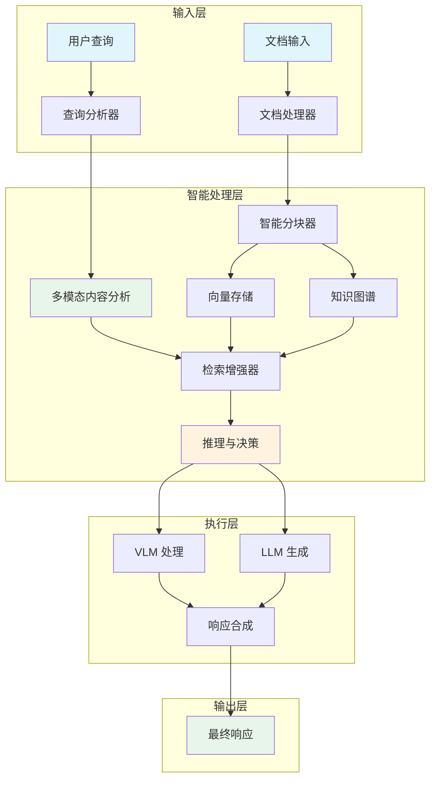

# Agentic RAG 工作流深度解析

## 概述

本文档深入分析 Agentic RAG（检索增强生成）的核心工作流程，重点介绍其智能决策、多模态处理和动态推理能力。基于 RAGAnything 框架的实现，本文档详细说明每个关键节点的技术实现和设计思路。

## 目录

1. [Agentic RAG 架构概览](#1-agentic-rag-架构概览)
2. [智能文档处理流程](#2-智能文档处理流程)
3. [多模态内容理解与处理](#3-多模态内容理解与处理)
4. [智能查询处理与推理](#4-智能查询处理与推理)
5. [VLM 增强的视觉理解](#5-vlm-增强的视觉理解)
6. [智能缓存与优化策略](#6-智能缓存与优化策略)
7. [工作流集成与扩展](#7-工作流集成与扩展)
8. [核心实现技术](#8-核心实现技术)
9. [性能优化与最佳实践](#9-性能优化与最佳实践)
10. [未来发展方向](#10-未来发展方向)

---

## 1. Agentic RAG 架构概览

### 1.1 核心架构设计



### 1.2 核心组件

| 组件 | 功能 | 关键实现 |
|------|------|----------|
| **查询分析器** | 分析用户查询意图和类型 | 意图识别、实体提取、查询扩展 |
| **文档处理器** | 解析和处理各种格式文档 | MinerU/Docling 解析器、OCR 处理 |
| **智能分块器** | 将内容分割为适合检索的块 | 基于 token、语义、类型的分块策略 |
| **多模态分析器** | 处理图像、表格、公式等内容 | 专门的模态处理器 |
| **检索增强器** | 执行智能检索策略 | 向量检索 + 知识图谱检索 |
| **推理与决策** | 智能决策和推理 | 上下文构建、推理链 |
| **VLM 处理器** | 视觉语言模型处理 | 图像分析、视觉理解 |
| **LLM 生成器** | 基于检索结果生成响应 | 提示工程、响应优化 |

### 1.3 与传统 RAG 的区别

| 特性 | 传统 RAG | Agentic RAG |
|------|---------|-------------|
| **查询处理** | 简单关键词匹配 | 智能意图识别和查询扩展 |
| **内容理解** | 纯文本处理 | 多模态内容理解 |
| **检索策略** | 单一向量检索 | 混合检索（向量 + 知识图谱） |
| **推理能力** | 有限推理 | 多步推理和决策 |
| **自适应能力** | 固定流程 | 动态调整流程和策略 |
| **扩展性** | 有限扩展 | 模块化插件架构 |

---

## 2. 智能文档处理流程

### 2.1 文档解析与预处理

**核心流程：**
1. **文件类型识别**：基于扩展名和内容分析
2. **格式转换**：Office 文档转换为 PDF
3. **内容提取**：使用 MinerU/Docling 提取结构化内容
4. **标准化处理**：统一不同格式的输出

**关键实现：**
```python
# 文档解析入口
async def parse_document(self, file_path, output_dir=None, parse_method=None):
    # 1. 生成缓存键
    # 2. 检查缓存
    # 3. 执行解析
    # 4. 标准化输出
    # 5. 缓存结果
```

**缓存机制：**
- 基于文件路径、修改时间、解析配置生成缓存键
- 验证缓存有效性（文件未修改、配置未变更）
- 缓存解析结果，避免重复解析

### 2.2 智能分块策略

**分块策略：**
1. **基于 Token 的分块**：控制块大小，确保适合 LLM 上下文
2. **基于语义的分块**：在段落、章节边界分割
3. **重叠分块**：保持上下文连续性
4. **类型感知分块**：针对不同内容类型采用不同策略

**多模态内容处理：**
- **图片**：生成详细描述，提取视觉特征
- **表格**：分析结构和数据，生成文本表示
- **公式**：解析 LaTeX，生成解释
- **代码**：保持代码片段完整性

**分块模板：**
```python
# 图片块模板
{
    "content": "图片路径: ...\n描述: ...",
    "tokens": 768,
    "doc_id": "doc-xxx",
    "chunk_id": "chunk-xxx",
    "is_multimodal": true,
    "original_type": "image"
}
```

---

## 3. 多模态内容理解与处理

### 3.1 模态处理器架构

**处理器类型：**
- **ImageModalProcessor**：图片内容处理
- **TableModalProcessor**：表格内容处理  
- **EquationModalProcessor**：公式内容处理
- **GenericModalProcessor**：通用内容处理

**处理器初始化：**
```python
def _initialize_processors(self):
    # 创建上下文提取器
    self.context_extractor = self._create_context_extractor()
    
    # 创建不同的多模态处理器
    self.modal_processors = {}
    
    if self.config.enable_image_processing:
        self.modal_processors["image"] = ImageModalProcessor(
            lightrag=self.lightrag,
            modal_caption_func=self.vision_model_func or self.llm_model_func,
            context_extractor=self.context_extractor,
        )
    # 其他处理器初始化...
```

### 3.2 上下文提取

**上下文配置：**
- `context_window`：上下文窗口大小
- `context_mode`：上下文模式（page/chunk）
- `max_context_tokens`：最大上下文 tokens
- `include_headers`：是否包含标题
- `include_captions`：是否包含图注/表注

**提取策略：**
1. **内容类型过滤**：根据需要过滤内容类型
2. **Token 计数**：控制上下文长度
3. **相关性排序**：优先选择相关内容
4. **格式保持**：保持原始格式和结构

### 3.3 多模态内容增强

**增强策略：**
1. **图片增强**：使用 VLM 生成详细描述
2. **表格增强**：分析表格结构和数据关系
3. **公式增强**：解析公式含义和应用场景
4. **上下文增强**：结合周围内容理解

**生成描述示例：**
```python
async def _describe_image_for_query(self, processor, content):
    image_path = content.get("img_path")
    if image_path and Path(image_path).exists():
        # 使用视觉模型生成描述
        image_base64 = processor._encode_image_to_base64(image_path)
        prompt = PROMPTS["QUERY_IMAGE_DESCRIPTION"]
        description = await processor.modal_caption_func(
            prompt,
            image_data=image_base64,
            system_prompt=PROMPTS["QUERY_IMAGE_ANALYST_SYSTEM"],
        )
        return description
```

---

## 4. 智能查询处理与推理

### 4.1 查询分析与理解

**查询类型识别：**
- **事实性问题**：谁、什么、何时、何地
- **解释性问题**：为什么、如何
- **比较性问题**：比较、对比
- **指令性问题**：总结、分析、生成

**查询预处理：**
- **分词**：将查询分解为词
- **实体识别**：识别查询中的实体
- **意图识别**：理解用户意图
- **查询扩展**：扩展查询以提高检索效果

### 4.2 多源检索策略

**检索方法：**
1. **向量检索**：从向量数据库检索相关分块
2. **图谱检索**：从知识图谱检索相关实体和关系
3. **混合检索**：结合多种检索结果

**检索参数：**
- `top_k`：返回的结果数量
- `similarity_threshold`：相似度阈值
- `filter`：基于元数据过滤

**检索优化：**
- **查询重写**：优化查询以提高检索效果
- **检索参数调整**：根据查询类型调整参数
- **反馈机制**：基于用户反馈优化检索

### 4.3 推理与决策

**推理策略：**
1. **多步推理**：分解复杂问题为多个步骤
2. **上下文整合**：整合来自不同来源的信息
3. **冲突解决**：处理信息冲突和不一致
4. **不确定性管理**：处理不确定信息

**决策过程：**
```python
async def aquery_with_multimodal(self, query, multimodal_content=None, mode="mix", **kwargs):
    # 1. 分析查询
    # 2. 处理多模态内容
    # 3. 执行检索
    # 4. 构建上下文
    # 5. 生成响应
    # 6. 缓存结果
```

---

## 5. VLM 增强的视觉理解

### 5.1 VLM 集成架构

**核心流程：**
1. **检索增强**：获取相关内容和图像
2. **图像处理**：提取和验证图像路径
3. **VLM 调用**：使用视觉模型分析图像
4. **响应生成**：结合文本和图像信息生成响应

**实现细节：**
```python
async def aquery_vlm_enhanced(self, query, mode="mix", **kwargs):
    # 1. 获取原始检索提示
    query_param = QueryParam(mode=mode, only_need_prompt=True, **kwargs)
    raw_prompt = await self.lightrag.aquery(query, param=query_param)
    
    # 2. 提取和处理图像路径
    enhanced_prompt, images_found = await self._process_image_paths_for_vlm(raw_prompt)
    
    # 3. 构建 VLM 消息格式
    messages = self._build_vlm_messages_with_images(enhanced_prompt, query)
    
    # 4. 调用 VLM 进行问答
    result = await self._call_vlm_with_multimodal_content(messages)
    
    return result
```

### 5.2 图像路径处理

**安全检查：**
- **路径验证**：验证图像文件存在且格式正确
- **安全目录**：只允许来自安全目录的图像
- **路径限制**：防止路径遍历攻击

**处理流程：**
1. **路径提取**：从检索结果中提取图像路径
2. **安全验证**：检查路径安全性
3. **图像编码**：将图像编码为 base64
4. **标记替换**：在提示中添加图像标记

### 5.3 多模态消息构建

**消息格式：**
```python
def _build_vlm_messages_with_images(self, enhanced_prompt, user_query):
    # 构建包含文本和图像的消息
    content_parts = []
    
    # 分割文本并插入图像
    text_parts = enhanced_prompt.split("[VLM_IMAGE_")
    
    for i, text_part in enumerate(text_parts):
        if i == 0:
            # 第一个文本部分
            if text_part.strip():
                content_parts.append({"type": "text", "text": text_part})
        else:
            # 插入图像和剩余文本
            marker_match = re.match(r"(\d+)\](.*)", text_part, re.DOTALL)
            if marker_match:
                image_num = int(marker_match.group(1)) - 1
                remaining_text = marker_match.group(2)
                
                # 插入图像
                if 0 <= image_num < len(self._current_images_base64):
                    content_parts.append({
                        "type": "image_url",
                        "image_url": {
                            "url": f"data:image/jpeg;base64,{self._current_images_base64[image_num]}"
                        },
                    })
                
                # 插入剩余文本
                if remaining_text.strip():
                    content_parts.append({"type": "text", "text": remaining_text})
    
    # 添加用户问题
    content_parts.append({
        "type": "text",
        "text": f"\n\nUser Question: {user_query}\n\nPlease answer based on the context and images provided.",
    })
    
    return [
        {
            "role": "system",
            "content": "You are a helpful assistant that can analyze both text and image content.",
        },
        {
            "role": "user",
            "content": content_parts,
        },
    ]
```

---

## 6. 智能缓存与优化策略

### 6.1 多级缓存架构

**缓存层级：**
1. **解析缓存**：缓存文档解析结果
2. **嵌入缓存**：缓存向量嵌入
3. **查询缓存**：缓存查询结果
4. **LLM 响应缓存**：缓存 LLM 响应

**缓存键生成：**
```python
def _generate_multimodal_cache_key(self, query, multimodal_content, mode, **kwargs):
    # 创建查询参数的规范化表示
    cache_data = {
        "query": query.strip(),
        "mode": mode,
    }
    
    # 规范化多模态内容
    normalized_content = []
    if multimodal_content:
        for item in multimodal_content:
            if isinstance(item, dict):
                normalized_item = {}
                for key, value in item.items():
                    # 对于文件路径，使用 basename 使缓存更可移植
                    if key in ["img_path", "image_path", "file_path"] and isinstance(value, str):
                        normalized_item[key] = Path(value).name
                    # 对于大内容，创建哈希而不是直接存储
                    elif key in ["table_data", "table_body"] and isinstance(value, str) and len(value) > 200:
                        normalized_item[f"{key}_hash"] = hashlib.md5(value.encode()).hexdigest()
                    else:
                        normalized_item[key] = value
                normalized_content.append(normalized_item)
            else:
                normalized_content.append(item)
    
    cache_data["multimodal_content"] = normalized_content
    
    # 添加相关参数
    relevant_kwargs = {k: v for k, v in kwargs.items() if k in ["stream", "response_type", "top_k", "max_tokens", "temperature", "system_prompt"]}
    cache_data.update(relevant_kwargs)
    
    # 生成哈希
    cache_str = json.dumps(cache_data, sort_keys=True, ensure_ascii=False)
    cache_hash = hashlib.md5(cache_str.encode()).hexdigest()
    
    return f"multimodal_query:{cache_hash}"
```

### 6.2 缓存策略优化

**缓存策略：**
- **过期策略**：基于时间和使用频率
- **大小限制**：设置缓存大小上限
- **一致性**：确保缓存与数据源一致
- **预加载**：预加载常用数据

**缓存使用：**
```python
# 检查缓存
if hasattr(self, "lightrag") and self.lightrag and hasattr(self.lightrag, "llm_response_cache"):
    if self.lightrag.llm_response_cache.global_config.get("enable_llm_cache", True):
        try:
            cached_result = await self.lightrag.llm_response_cache.get_by_id(cache_key)
            if cached_result and isinstance(cached_result, dict):
                result_content = cached_result.get("return")
                if result_content:
                    self.logger.info(f"Multimodal query cache hit: {cache_key[:16]}...")
                    return result_content
        except Exception as e:
            self.logger.debug(f"Error accessing multimodal query cache: {e}")
```

---

## 7. 工作流集成与扩展

### 7.1 模块化架构

**核心模块：**
- **解析模块**：处理文档解析
- **处理模块**：处理内容分块和多模态处理
- **查询模块**：处理查询和响应生成
- **批处理模块**：处理批量文档处理

**扩展点：**
1. **解析器扩展**：添加新的文档解析器
2. **处理器扩展**：添加新的多模态处理器
3. **存储扩展**：添加新的存储后端
4. **模型扩展**：集成新的 LLM 和 VLM 模型

### 7.2 回调系统

**回调事件：**
- `on_parse_start`：开始解析文档前
- `on_parse_complete`：解析完成后
- `on_parse_error`：解析出错时
- `on_multimodal_start`：开始多模态处理前
- `on_multimodal_complete`：多模态处理完成后
- `on_query_start`：查询开始前
- `on_query_complete`：查询完成后
- `on_query_error`：查询出错时

**使用示例：**
```python
# 自定义回调
rag.callback_manager.on_parse_start = lambda file_path, parser: print(f"开始解析 {file_path} 使用 {parser}")
rag.callback_manager.on_query_complete = lambda **kwargs: print(f"查询完成，耗时 {kwargs['duration_seconds']:.2f}s")
```

### 7.3 配置系统

**配置管理：**
- **环境变量**：从环境变量加载配置
- **运行时配置**：支持运行时更新配置
- **默认值**：提供合理的默认值

**配置参数：**
- **目录配置**：工作目录、输出目录
- **解析配置**：解析器选择、解析方法
- **多模态配置**：启用/禁用各种模态处理
- **上下文配置**：上下文窗口、模式
- **批处理配置**：并发数、文件扩展名

---

## 8. 核心实现技术

### 8.1 异步编程

**异步处理：**
- 使用 `asyncio` 实现异步操作
- 并发处理多模态内容
- 异步缓存操作
- 异步 LLM 和 VLM 调用

**实现示例：**
```python
async def _process_multimodal_content_batch_type_aware(self, content_list, doc_id, file_ref):
    # 创建并发任务
    semaphore = asyncio.Semaphore(self.lightrag.max_parallel_insert)
    tasks = []
    
    for i, item in enumerate(content_list):
        task = asyncio.create_task(
            self._process_single_multimodal_item(
                item, doc_id, file_ref, i, semaphore
            )
        )
        tasks.append(task)
    
    # 等待所有任务完成
    results = await asyncio.gather(*tasks, return_exceptions=True)
    
    # 过滤成功结果
    successful_results = []
    for result in results:
        if isinstance(result, Exception):
            self.logger.error(f"Multimodal processing failed: {result}")
        elif result:
            successful_results.append(result)
    
    return successful_results
```

### 8.2 安全处理

**安全措施：**
- **路径验证**：防止路径遍历攻击
- **输入验证**：验证用户输入
- **权限控制**：控制文件访问权限
- **内容过滤**：过滤敏感内容

**实现示例：**
```python
def validate_image_file(image_path):
    """验证图像文件"""
    try:
        path = Path(image_path)
        if not path.exists():
            return False
        if not path.is_file():
            return False
        # 检查文件扩展名
        ext = path.suffix.lower()
        if ext not in ['.jpg', '.jpeg', '.png', '.gif', '.bmp', '.webp', '.tiff', '.tif']:
            return False
        # 检查文件大小
        if path.stat().st_size > 10 * 1024 * 1024:  # 10MB
            return False
        return True
    except Exception:
        return False
```

### 8.3 错误处理

**错误处理策略：**
- **优雅降级**：在出错时降级到备用方案
- **错误日志**：详细记录错误信息
- **异常捕获**：捕获和处理异常
- **恢复机制**：从错误中恢复

**实现示例：**
```python
try:
    # 执行操作
    result = await self.lightrag.aquery(query, param=query_param, system_prompt=system_prompt)
except Exception as exc:
    if callback_manager is not None:
        callback_manager.dispatch(
            "on_query_error",
            query=query,
            mode=mode,
            error=exc,
        )
    raise
```

---

## 9. 性能优化与最佳实践

### 9.1 解析优化

**解析性能：**
- **并行处理**：同时处理多个文档
- **缓存机制**：缓存解析结果
- **增量解析**：只解析修改的文档
- **解析策略**：根据文档类型选择最优解析方法

**内存管理：**
- **流式处理**：处理大文档时使用流式方法
- **内存限制**：设置合理的内存使用限制
- **资源监控**：监控内存和 CPU 使用

### 9.2 检索优化

**向量检索优化：**
- **索引优化**：选择合适的索引类型和参数
- **批量操作**：使用批量插入和查询
- **数据压缩**：压缩存储数据
- **分区策略**：根据数据特性分区

**混合检索策略：**
- **向量 + 关键词**：结合向量检索和关键词检索
- **分层检索**：先粗检索再精排序
- **相关性排序**：优化检索结果排序

### 9.3 LLM 调用优化

**调用策略：**
- **批处理**：批量处理多个查询
- **缓存响应**：缓存 LLM 响应
- **模型选择**：根据任务选择合适的模型
- **参数调优**：调整模型参数以平衡速度和质量

**提示优化：**
- **指令明确**：清晰说明任务要求
- **上下文组织**：合理组织上下文信息
- **格式规范**：指定输出格式
- **思维链**：鼓励逐步推理

### 9.4 部署最佳实践

**部署策略：**
- **容器化**：使用 Docker 容器化部署
- **扩展策略**：水平扩展以处理更多请求
- **负载均衡**：分发请求以平衡负载
- **监控系统**：监控系统性能和健康状态

**资源管理：**
- **资源分配**：根据工作负载分配资源
- **自动扩缩容**：根据负载自动调整资源
- **成本优化**：优化模型使用成本
- **可靠性**：确保系统可靠性和可用性

---

## 10. 未来发展方向

### 10.1 技术趋势

**发展方向：**
1. **更智能的分块策略**：基于语义和上下文的动态分块
2. **多模态融合**：更深度的多模态内容融合
3. **自适应检索**：根据查询类型自动调整检索策略
4. **推理增强**：更复杂的推理链和逻辑推理
5. **个性化**：基于用户历史和偏好的个性化响应

### 10.2 技术挑战

**挑战：**
- **计算成本**：平衡性能和成本
- **可扩展性**：处理大规模知识库
- **准确性**：减少幻觉和错误
- **实时性**：降低响应时间
- **安全性**：确保系统安全

### 10.3 应用场景

**潜在应用：**
- **智能助手**：个人和企业智能助手
- **知识管理**：企业知识管理系统
- **教育培训**：智能教育辅助系统
- **医疗健康**：医疗信息检索和分析
- **法律金融**：法律和金融文档分析

---

## 总结

Agentic RAG 是 RAG 技术的进阶形态，通过引入智能决策、多模态理解和动态推理能力，大幅提升了系统的性能和用户体验。本文档深入分析了其核心工作流程和实现细节，为开发者提供了全面的技术参考。

**核心优势：**
- **智能决策**：能够根据查询和内容类型做出智能决策
- **多模态理解**：处理文本、图片、表格、公式等多种内容
- **动态推理**：支持多步推理和复杂逻辑
- **自适应能力**：根据上下文和需求调整处理策略
- **可扩展性**：模块化架构支持灵活扩展

**技术价值：**
- 为复杂问题提供更准确、全面的解决方案
- 减少 LLM 幻觉，提高回答的可靠性
- 处理多模态内容，扩展应用场景
- 优化系统性能，提升用户体验

随着技术的不断发展，Agentic RAG 将会在更多领域发挥重要作用，为智能系统的发展提供新的可能性。