# RAG-Anything 工作流分析文档

## 概述

RAG-Anything 是一个全功能的多模态 RAG 系统，能够无缝处理包含文本、图像、表格、公式等多模态内容的复杂文档。本文档将详细分析其工作流程、架构设计和核心功能。

## 核心架构

### 系统设计哲学

RAG-Anything 采用混合架构设计，结合了：

1. **LightRAG 作为底层 RAG 引擎**：提供知识图谱、向量检索和实体关系处理
2. **多模态内容解析层**：使用 MinerU/Docling 等解析器提取文档内容
3. **专用模态处理器**：针对不同内容类型的专门处理单元
4. **灵活的查询接口**：支持纯文本、多模态和 VLM 增强查询

### 类架构

```mermaid
classDiagram
    class RAGAnything {
        +lightrag: LightRAG
        +llm_model_func: Callable
        +vision_model_func: Callable
        +embedding_func: Callable
        +config: RAGAnythingConfig
        +modal_processors: Dict[str, ModalProcessor]
        +parse_document()
        +process_document_complete()
        +aquery()
        +aquery_with_multimodal()
        +aquery_vlm_enhanced()
        +process_folder_complete()
    }
    
    class RAGAnythingConfig {
        +working_dir: str
        +parser: str
        +parse_method: str
        +enable_image_processing: bool
        +enable_table_processing: bool
        +enable_equation_processing: bool
        +max_concurrent_files: int
        +context_window: int
    }
    
    class QueryMixin {
        +aquery()
        +aquery_with_multimodal()
        +aquery_vlm_enhanced()
        +query()
    }
    
    class ProcessorMixin {
        +parse_document()
        +_process_multimodal_content()
        +insert_content_list()
    }
    
    class BatchMixin {
        +process_documents_batch()
        +process_documents_with_rag_batch()
        +process_folder_complete()
    }
    
    class ImageModalProcessor {
        +process_multimodal_content()
        +generate_description_only()
    }
    
    class TableModalProcessor {
        +process_multimodal_content()
        +generate_description_only()
    }
    
    class EquationModalProcessor {
        +process_multimodal_content()
        +generate_description_only()
    }
    
    class GenericModalProcessor {
        +process_multimodal_content()
        +generate_description_only()
    }
    
    class ContextExtractor {
        +extract_context()
    }
    
    RAGAnything --|&gt; QueryMixin
    RAGAnything --|&gt; ProcessorMixin
    RAGAnything --|&gt; BatchMixin
    RAGAnything --* RAGAnythingConfig
    RAGAnything o-- ImageModalProcessor
    RAGAnything o-- TableModalProcessor
    RAGAnything o-- EquationModalProcessor
    RAGAnything o-- GenericModalProcessor
    RAGAnything o-- ContextExtractor
```

## 完整文档处理工作流

### 端到端处理流程图

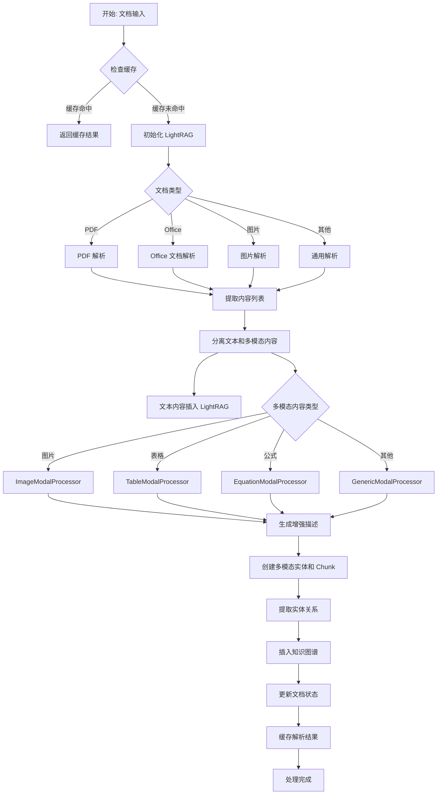

### 详细步骤说明

#### 1. 初始化阶段

```python
# 初始化流程
1. 加载配置 (RAGAnythingConfig)
2. 初始化文档解析器 (MinerU/Docling/PaddleOCR)
3. 配置工作目录和日志
4. 注册清理回调 (atexit)
```

#### 2. 文档解析阶段

**核心方法**: `parse_document()`

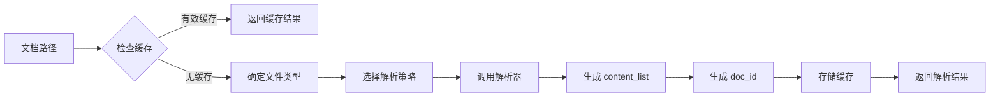

**解析器支持**:
- **MinerU**: 支持 PDF、Office、图片（推荐）
- **Docling**: 专门优化 Office 文档
- **PaddleOCR**: OCR 专用解析器

**解析方法**:
- `auto`: 自动模式（推荐）
- `ocr`: OCR 模式
- `txt`: 纯文本模式

#### 3. 内容处理阶段

**核心方法**: `process_document_complete()`

这是主入口方法，协调整个处理流程：

```python
async def process_document_complete(
    self,
    file_path: str,
    output_dir: str = None,
    parse_method: str = None,
    display_stats: bool = None,
    split_by_character: str = None,
    split_by_character_only: bool = False,
    doc_id: str = None,
    **kwargs
)
```

**处理步骤**:
1. 确保 LightRAG 初始化
2. 解析文档（或从缓存加载）
3. 分离文本和多模态内容
4. 插入文本内容到 LightRAG
5. 处理多模态内容
6. 标记处理完成

### 缓存机制

RAG-Anything 实现了智能缓存系统：

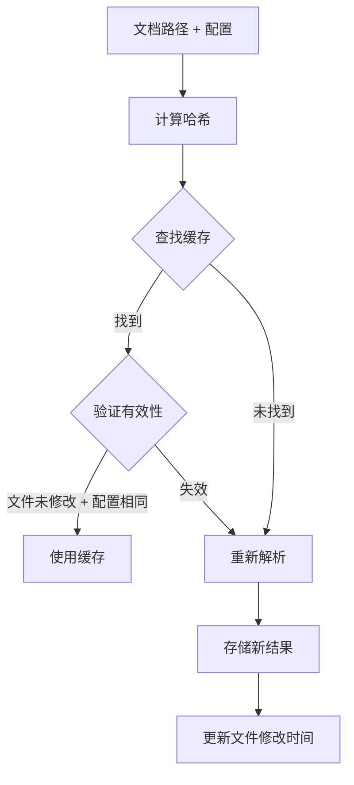

**缓存键生成要素**:
- 文件绝对路径
- 文件修改时间
- 解析器类型
- 解析方法
- 其他解析参数（语言、设备等）

## 多模态内容处理

### 多模态处理架构

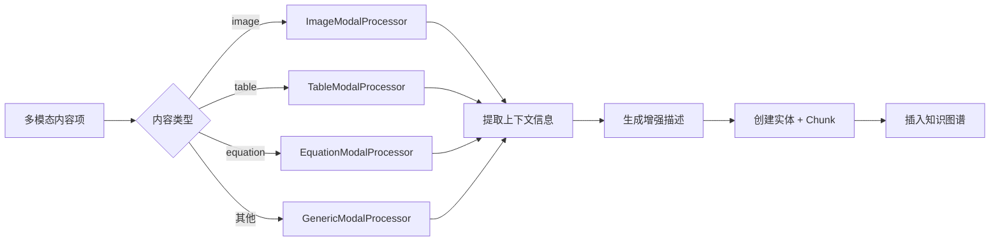

### 上下文提取机制

ContextExtractor 提供智能上下文提取：

```python
class ContextExtractor:
    # 支持模式
    context_mode: "page"  # 基于页面的上下文
    context_window: int   # 上下文窗口大小（前后页数）
    max_context_tokens: int  # 最大上下文 token 数
    include_headers: bool  # 是否包含标题
    include_captions: bool  # 是否包含图片/表格标题
```

### 各模态处理器详解

#### 1. 图片处理器 (ImageModalProcessor)

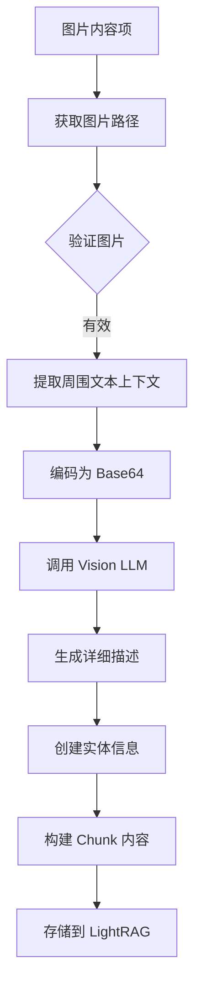

**核心提示模板**:
```python
{
    "context": "文档周围文本内容",
    "img_path": "图片路径",
    "captions": "图片标题列表",
    "footnotes": "图片脚注列表"
}
```

#### 2. 表格处理器 (TableModalProcessor)

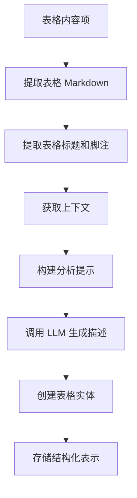

**分析重点**:
- 表格结构识别
- 数据趋势分析
- 关键数值提取
- 与文档上下文关系

#### 3. 公式处理器 (EquationModalProcessor)

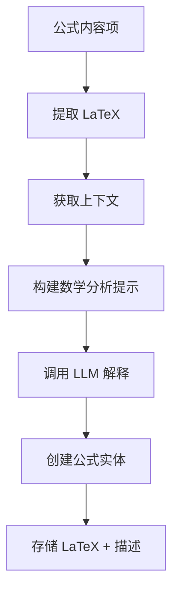

**分析重点**:
- 公式含义解释
- 数学概念映射
- 变量定义说明
- 应用场景识别

### 批处理模式优化

RAG-Anything 实现了类型感知的批处理：


**优化策略**:
1. 并发描述生成（使用 semaphore 控制并发度）
2. 类型感知处理路由
3. 批量存储操作
4. 统一的知识图谱合并

## 查询系统工作流

### 查询类型概览

RAG-Anything 支持三种查询模式：

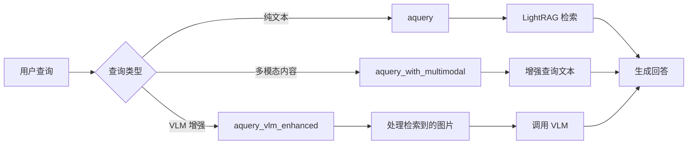

### 1. 纯文本查询 (aquery)

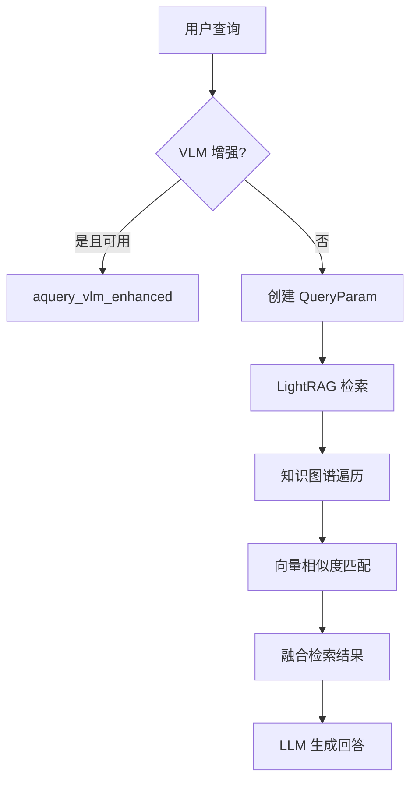

**查询模式**:
- `local`: 本地检索（基于 Chunk）
- `global`: 全局检索（基于知识图谱）
- `hybrid`: 混合检索（推荐）
- `naive`: 朴素检索
- `mix`: 混合模式

### 2. 多模态查询 (aquery_with_multimodal)

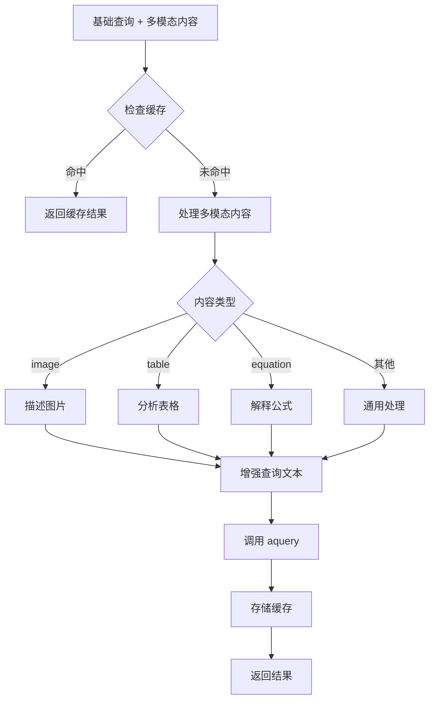

**多模态内容格式**:
```python
multimodal_content = [
    {
        "type": "image",
        "img_path": "/path/to/image.jpg",
        "image_caption": ["图片标题"],
        "image_footnote": ["图片脚注"]
    },
    {
        "type": "table",
        "table_data": "Markdown 表格",
        "table_caption": ["表格标题"]
    },
    {
        "type": "equation",
        "latex": "E = mc²",
        "equation_caption": ["公式标题"]
    }
]
```

### 3. VLM 增强查询 (aquery_vlm_enhanced)

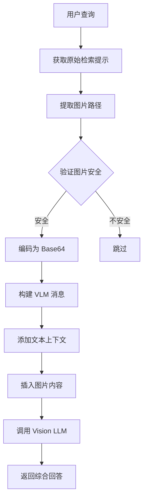

**安全检查**:
- 图片路径验证
- 安全目录白名单
- 文件类型验证
- 路径规范化

**VLM 消息格式**:
```python
messages = [
    {
        "role": "system",
        "content": "系统提示"
    },
    {
        "role": "user",
        "content": [
            {"type": "text", "text": "文本上下文"},
            {
                "type": "image_url",
                "image_url": {"url": "data:image/jpeg;base64,..."}
            },
            {"type": "text", "text": "用户查询"}
        ]
    }
]
```

## 批处理工作流

### BatchParser 架构

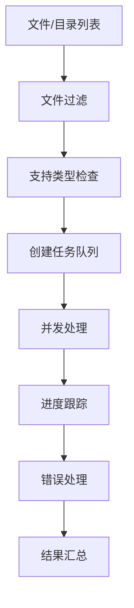

### 批处理流程详解

#### 1. 基础批处理 (BatchParser)


**关键配置**:
```python
BatchParser(
    parser_type="mineru",
    max_workers=3,
    show_progress=True,
    timeout_per_file=60,
    skip_installation_check=False
)
```

#### 2. RAG 集成批处理

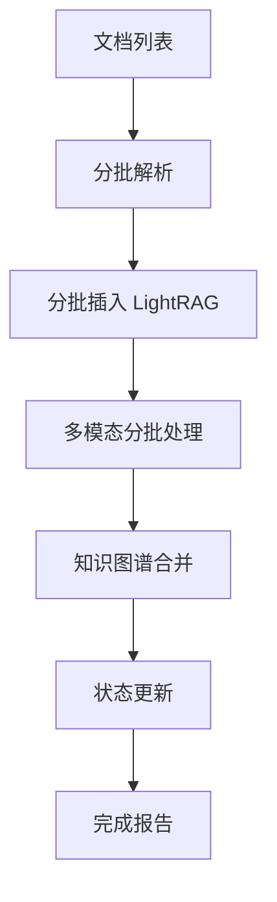

**主方法**:
- `process_documents_batch()`: 仅解析文档
- `process_documents_with_rag_batch()`: 完整 RAG 处理
- `process_folder_complete()`: 处理整个目录

### 错误处理和重试

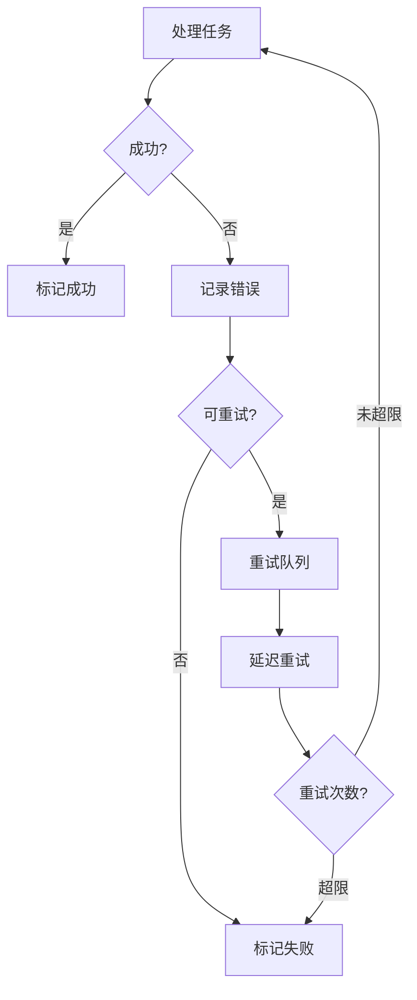

## 配置系统

### RAGAnythingConfig 详解

```python
@dataclass
class RAGAnythingConfig:
    # 目录配置
    working_dir: str  # RAG 存储目录
    parser_output_dir: str  # 解析结果输出目录
    
    # 解析器配置
    parse_method: str  # auto/ocr/txt
    parser: str  # mineru/docling/paddleocr
    display_content_stats: bool  # 显示内容统计
    
    # 多模态处理配置
    enable_image_processing: bool
    enable_table_processing: bool
    enable_equation_processing: bool
    
    # 批处理配置
    max_concurrent_files: int
    supported_file_extensions: List[str]
    recursive_folder_processing: bool
    
    # 上下文提取配置
    context_window: int
    context_mode: str
    max_context_tokens: int
    include_headers: bool
    include_captions: bool
    context_filter_content_types: List[str]
    content_format: str
    
    # 路径处理配置
    use_full_path: bool
```

### 环境变量支持

所有配置项都支持通过环境变量设置：

```bash
# 示例 .env 文件
WORKING_DIR=./rag_storage
OUTPUT_DIR=./output
PARSER=mineru
PARSE_METHOD=auto
ENABLE_IMAGE_PROCESSING=true
ENABLE_TABLE_PROCESSING=true
ENABLE_EQUATION_PROCESSING=true
MAX_CONCURRENT_FILES=1
CONTEXT_WINDOW=1
CONTEXT_MODE=page
MAX_CONTEXT_TOKENS=2000
```

## 内容列表插入模式

### 直接内容插入流程

当已有预解析的内容时，可以跳过文档解析阶段：

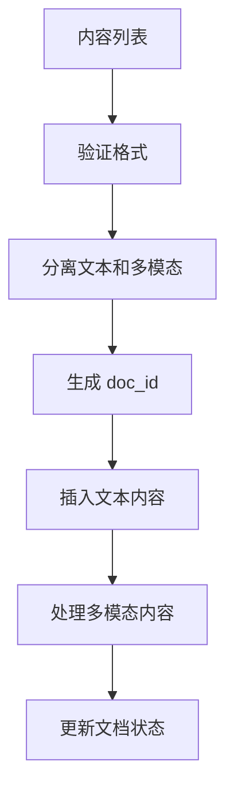

### 内容列表格式

```python
content_list = [
    {
        "type": "text",
        "text": "文本内容",
        "page_idx": 0
    },
    {
        "type": "image",
        "img_path": "/absolute/path/to/image.jpg",
        "image_caption": ["标题"],
        "image_footnote": ["脚注"],
        "page_idx": 1
    },
    {
        "type": "table",
        "table_body": "Markdown 表格",
        "table_caption": ["标题"],
        "table_footnote": ["脚注"],
        "page_idx": 2
    },
    {
        "type": "equation",
        "latex": "LaTeX 公式",
        "text": "公式描述",
        "page_idx": 3
    }
]
```

## 知识图谱集成

### 多模态实体表示


### 关系类型

- **belongs_to**: 多模态内容属于文档
- **related_to**: 内容之间的语义关联
- **contains**: 文档包含内容项
- **references**: 文本引用多模态内容

## 回调系统

RAGAnything 支持事件回调机制：

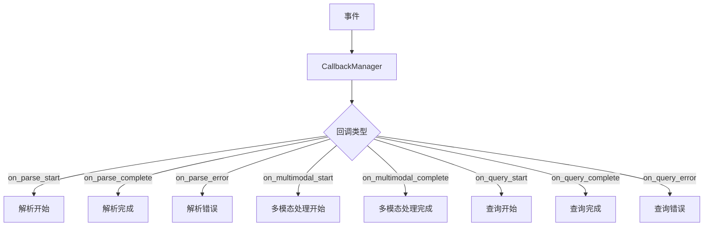

## 性能优化策略

### 1. 缓存策略

- 解析结果缓存
- 查询结果缓存
- LLM 响应缓存

### 2. 并发控制

- 文档级并发（`max_concurrent_files`）
- 多模态处理并发（LightRAG `max_parallel_insert`）
- API 调用限流

### 3. 批处理优化

- 批量存储操作
- 并发描述生成
- 增量知识图谱合并

## 错误处理和恢复

### 常见错误类型

1. **解析错误**: 文档格式不支持、解析器故障
2. **处理错误**: LLM API 失败、图片处理错误
3. **存储错误**: 磁盘空间不足、权限问题
4. **查询错误**: 检索失败、生成超时

### 恢复策略

```mermaid
flowchart TD
    A[错误发生] --> B[错误分类]
    B --> C{可恢复?}
    C -->|是| D[记录状态]
    D --> E[清理临时文件]
    E --> F[准备重试]
    C -->|否| G[标记失败]
    G --> H[继续其他处理]
    F --> I[重试操作]
```

## 最佳实践

### 1. 文档处理建议

- 使用 `auto` 解析方法获得最佳平衡
- 启用所有多模态处理器以获得完整功能
- 配置合理的上下文窗口大小（1-3 页）
- 使用绝对路径避免图片引用问题

### 2. 性能优化建议

- 对于大量文档，使用批处理功能
- 合理配置 `max_workers`（CPU 核心数的 1-2 倍）
- 启用缓存避免重复解析
- 根据文档大小调整超时设置

### 3. 查询建议

- 对于包含图片的文档，使用 VLM 增强查询
- 对于带额外多模态内容的查询，使用 `aquery_with_multimodal`
- 使用 `hybrid` 模式获得最佳检索效果
- 合理配置查询参数（`top_k`、`max_tokens` 等）

## 扩展点和自定义

### 1. 自定义模态处理器

继承 `GenericModalProcessor` 或 `BaseModalProcessor`：

```python
class CustomModalProcessor(GenericModalProcessor):
    async def generate_description_only(
        self,
        modal_content,
        content_type: str,
        item_info: Dict[str, Any] = None,
        entity_name: str = None,
    ):
        # 自定义处理逻辑
        pass
```

### 2. 自定义解析器

通过 `register_parser()` 注册新解析器：

```python
from raganything.parser import register_parser, BaseParser

class CustomParser(BaseParser):
    def parse_pdf(self, pdf_path, output_dir, method="auto", **kwargs):
        # 自定义 PDF 解析
        pass

register_parser("custom", CustomParser)
```

### 3. 回调集成

```python
from raganything.callbacks import CallbackManager

rag = RAGAnything(...)

# 注册回调
rag.callback_manager.register("on_parse_complete", my_callback_func)
```

## 总结

RAG-Anything 通过精心设计的模块化架构，实现了：

1. **完整的多模态支持**: 从解析到检索的端到端处理
2. **灵活的配置系统**: 支持环境变量和代码配置
3. **高效的批处理**: 并发处理 + 智能缓存
4. **多种查询模式**: 纯文本、多模态、VLM 增强
5. **可扩展的设计**: 易于添加新模态处理器和解析器

这个工作流分析文档涵盖了 RAG-Anything 的核心机制、设计理念和使用方法，为深入理解和有效使用该系统提供了全面参考。

