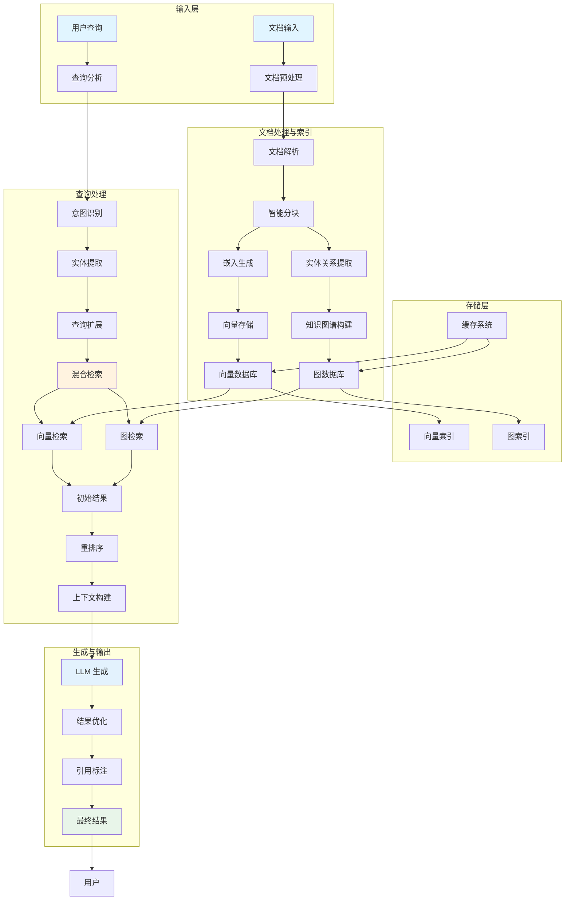

# lightRag工作流

```mermaid
graph TD
    subgraph 输入层
        A[文档输入] --> B[文档预处理]
        C[用户查询] --> D[查询分析]
    end
    
    subgraph 文档处理与索引
        B --> E[文档解析]
        E --> F[智能分块]
        F --> G[嵌入生成]
        F --> H[实体关系提取]
        G --> I[向量存储]
        H --> J[知识图谱构建]
        I --> K[向量数据库]
        J --> L[图数据库]
    end
    
    subgraph 存储层
        K --> M[向量索引]
        L --> N[图索引]
        O[缓存系统] --> K
        O --> L
    end
    
    subgraph 查询处理
        D --> P[意图识别]
        P --> Q[实体提取]
        Q --> R[查询扩展]
        R --> S[混合检索]
        S --> T[向量检索]
        S --> U[图检索]
        T --> V[初始结果]
        U --> V
        V --> W[重排序]
        W --> X[上下文构建]
    end
    
    subgraph 生成与输出
        X --> Y[LLM 生成]
        Y --> Z[结果优化]
        Z --> AA[引用标注]
        AA --> BB[最终结果]
    end
    
    K --> T
    L --> U
    BB --> CC[用户]
    
    style A fill:#e1f5ff
    style C fill:#e1f5ff
    style BB fill:#e8f5e9
    style S fill:#fff3e0
    style Y fill:#e3f2fd
```