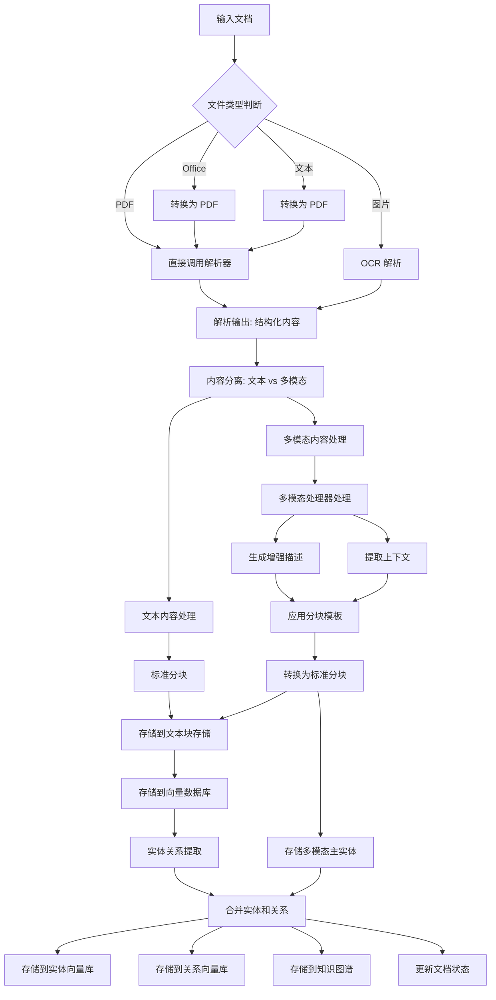
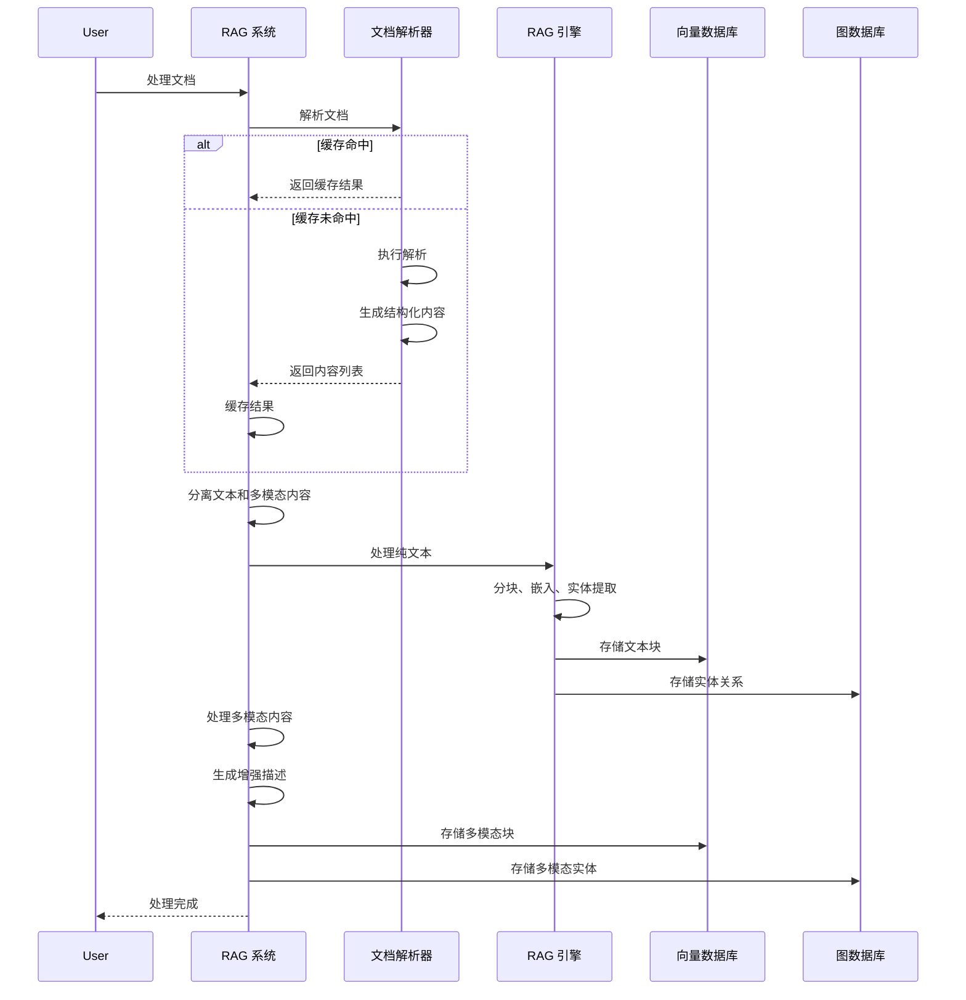

# 文档解析与智能分块工作流

## 概述

本文档详细介绍 RAG 系统的文档解析、智能分块、向量数据库和图数据库存储的完整工作流程，提供核心思路和关键实现方法。

---

## 1. 文档解析流程

### 1.1 核心解析器工作原理

**工作原理：**
1. **文件预处理**：检查文件类型，Office 文档会先转换为 PDF
2. **调用解析工具**：执行解析命令，支持多种解析方法（auto/txt/ocr）
3. **读取输出文件**：解析生成的结构化输出（如 Markdown 和 JSON）
4. **标准化字段名**：兼容不同版本的输出格式
5. **修正路径**：将相对路径转换为绝对路径，确保安全

### 1.2 支持的文件格式处理

| 文件格式 | 处理方式 | 说明 |
|---------|---------|------|
| **PDF** | 直接解析 | 支持 `auto`/`txt`/`ocr` 三种解析方法 |
| **Office** | 转换为 PDF | 通过 LibreOffice 转换为 PDF 后解析 |
| **图片** | OCR 解析 | 支持常见图片格式，非原生格式自动转换 |
| **文本** | 转换为 PDF | 文本文件通过 ReportLab 转换为 PDF 后解析 |

### 1.3 解析结果的数据结构

解析后的内容列表包含以下类型的内容块：

```python
# 文本块
{
    "type": "text",
    "text": "文本内容...",
    "page_idx": 0
}

# 图片块
{
    "type": "image",
    "img_path": "/绝对路径/图片.png",
    "image_caption": ["图片标题"],
    "image_footnote": ["图片脚注"],
    "page_idx": 0
}

# 表格块
{
    "type": "table",
    "table_img_path": "/绝对路径/表格.png",
    "table_caption": ["表格标题"],
    "table_body": "表格 HTML/Markdown",
    "table_footnote": ["表格脚注"],
    "page_idx": 0
}

# 公式块
{
    "type": "equation",
    "text": "LaTeX 公式",
    "text_format": "latex",
    "equation_img_path": "/绝对路径/公式.png",
    "page_idx": 0
}
```

---

## 2. 智能分块机制

### 2.1 文本内容的分块策略

**核心配置：**
- `chunk_token_size`: 单块最大 token 数（默认 800）
- `chunk_overlap_token_size`: 块之间的重叠 token 数（默认 100）
- `tokenizer`: 使用 tiktoken 分词器

**分块算法：**
1. 基于 token 计数进行分块
2. 保持语义完整性（优先在段落边界分割）
3. 块之间保持重叠，确保上下文连续性

### 2.2 多模态内容的处理方法

**处理器设计：**
- **ImageProcessor**: 图片内容处理
- **TableProcessor**: 表格内容处理  
- **EquationProcessor**: 公式内容处理
- **GenericProcessor**: 通用内容处理

**处理流程：**
1. **分离内容**：将文本和多模态内容分开处理
2. **文本处理**：通过标准 RAG 流程处理纯文本
3. **多模态处理**：
   - 使用专门的处理器为每个多模态内容生成增强描述
   - 提取周围上下文，增强语义理解
   - 转换为标准分块格式
   - 存储到向量数据库和图数据库

### 2.3 块的元数据结构

**文本块元数据：**
```python
{
    "content": "文本内容...",
    "tokens": 512,
    "full_doc_id": "doc-xxx",
    "chunk_order_index": 0,
    "file_path": "document.pdf"
}
```

**多模态块元数据：**
```python
{
    "content": "图片/表格/公式分析...（使用模板格式化）",
    "tokens": 768,
    "full_doc_id": "doc-xxx",
    "chunk_order_index": 5,
    "file_path": "document.pdf",
    "is_multimodal": true,
    "modal_entity_name": "图1：系统架构图",
    "original_type": "image",
    "page_idx": 0
}
```

**分块模板设计：**
- 图片块：包含路径、标题、脚注和增强描述
- 表格块：包含表格数据、标题、脚注和分析结果
- 公式块：包含 LaTeX 公式和解释

---

## 3. 向量数据库交互

### 3.1 向量存储结构

**存储结构：**
- **键**：分块 ID (`chunk-xxx`)
- **值**：分块内容及其向量嵌入
- **索引**：HNSW 或其他向量索引结构

### 3.2 文本嵌入的处理

**核心流程：**
1. **嵌入函数**：通过配置的 `embedding_func` 生成向量
2. **批量处理**：支持配置批量大小和并发数
3. **缓存机制**：缓存嵌入结果，避免重复计算
4. **向量存储**：将向量存储到向量数据库

### 3.3 多模态内容的特殊处理

**处理策略：**
1. **内容增强**：
   - 图像：使用视觉模型生成详细描述
   - 表格：使用 LLM 分析表格结构和数据
   - 公式：使用 LLM 解析和解释公式
2. **模板格式化**：使用专门的模板增强检索相关性
3. **实体关联**：将多模态内容作为独立实体存储

---

## 4. 图数据库集成

### 4.1 知识图谱的构建流程

**构建流程：**
1. **实体提取**：从分块中提取实体
2. **关系提取**：提取实体间的关系
3. **图谱构建**：构建节点和边
4. **合并处理**：合并相似实体和关系

**多模态特殊处理：**
- 多模态内容会生成专门的 "主实体"（如 "图1：架构图"）
- 添加 `belongs_to` 关系，关联多模态块与文档

### 4.2 实体和关系存储

**实体数据结构：**
```python
{
    "entity_name": "图1：系统架构图",
    "entity_type": "image",
    "content": "图片摘要...",
    "source_id": "chunk-xxx",
    "file_path": "document.pdf"
}
```

**存储位置：**
- **图数据库**：存储实体关系图
- **实体向量库**：存储实体向量，支持实体检索
- **完整实体存储**：存储详细实体信息
- **实体-分块关联**：存储实体与分块的对应关系

---

## 5. 完整数据流图



**处理时序图：**



---

## 6. 核心实现思路

### 6.1 文档解析核心思路

**文件类型识别与处理：**
- 基于文件扩展名识别类型
- 对不同类型采用不同处理策略
- 非 PDF 格式先转换为 PDF

**解析器选择：**
- 支持多种解析器（如 MinerU、Docling、PaddleOCR）
- 可配置解析方法（auto/txt/ocr）
- 针对不同内容类型优化解析参数

**缓存机制：**
- 基于文件路径、修改时间、解析配置生成缓存键
- 验证缓存有效性（文件未修改、配置未变更）
- 缓存解析结果，避免重复解析

### 6.2 智能分块核心思路

**文本分块策略：**
- 基于 token 计数的分块
- 保持语义完整性
- 块间重叠确保上下文连续性

**多模态处理策略：**
- 类型感知的处理器设计
- 上下文提取增强理解
- 模板化分块提高检索效果

**批处理优化：**
- 并发处理多模态内容
- 批量存储到数据库
- 错误处理和恢复机制

### 6.3 向量数据库交互核心思路

**向量存储设计：**
- 统一的分块格式
- 批量嵌入处理
- 高效的向量索引

**检索优化：**
- 混合检索策略（向量 + 关键词）
- 多模态内容的特殊检索处理
- 相关性排序

### 6.4 图数据库集成核心思路

**知识图谱构建：**
- 实体提取和关系识别
- 多模态实体的特殊处理
- 实体合并和去重

**图查询优化：**
- 基于图的语义检索
- 实体关联增强
- 路径分析和推理

---

## 7. 配置参数说明

| 配置项 | 说明 | 默认值 |
|-------|------|-------|
| `working_dir` | RAG 存储和缓存目录 | `./rag_storage` |
| `parser` | 解析器选择 | `mineru` |
| `parse_method` | 解析方法 | `auto` |
| `enable_image_processing` | 启用图片处理 | `True` |
| `enable_table_processing` | 启用表格处理 | `True` |
| `enable_equation_processing` | 启用公式处理 | `True` |
| `context_window` | 上下文窗口大小 | `1` |
| `context_mode` | 上下文模式 | `page` |
| `max_context_tokens` | 上下文最大 token 数 | `2000` |
| `max_concurrent_files` | 最大并发文件数 | `1` |

**配置管理：**
- 支持从环境变量加载配置
- 运行时可动态更新配置
- 配置验证和默认值处理

---

## 8. 最佳实践

### 8.1 解析优化

**文件预处理：**
- 对于 Office 文档，确保安装了 LibreOffice
- 对于大文件，考虑分批次处理
- 配置合适的解析方法（auto/txt/ocr）

**缓存策略：**
- 启用解析缓存提高性能
- 定期清理过期缓存
- 监控缓存大小，避免过度占用磁盘

### 8.2 分块优化

**文本分块：**
- 根据文档类型调整 `chunk_token_size`
- 对于技术文档，适当减小块大小以保持代码片段完整性
- 对于长文本，使用合理的重叠比例

**多模态处理：**
- 为图片处理提供高质量的视觉模型
- 调整上下文窗口大小，平衡精度和性能
- 优化提示模板，提高描述质量

### 8.3 数据库优化

**向量数据库：**
- 选择合适的向量维度和索引类型
- 配置适当的批量大小和并发数
- 定期维护向量索引

**图数据库：**
- 优化实体提取规则，减少噪声实体
- 配置合理的实体合并策略
- 监控图数据库大小和查询性能

---

## 9. 扩展和定制

### 9.1 解析器扩展

**自定义解析器：**
- 实现标准解析接口
- 注册到解析器注册表
- 支持新的文件格式

### 9.2 处理器扩展

**自定义处理器：**
- 继承基础处理器类
- 实现特定内容类型的处理逻辑
- 注册到处理器映射

### 9.3 存储扩展

**自定义存储：**
- 实现存储接口
- 支持不同的向量数据库后端
- 集成外部知识图谱系统

---

## 10. 总结

本文档提供了 RAG 系统中文档解析、智能分块、向量数据库和图数据库集成的核心工作流程。通过模块化设计和灵活的配置，该系统能够处理各种格式的文档，并将多模态内容有效地集成到 RAG 流程中。

**核心优势：**
- 多格式文档支持
- 智能分块策略
- 多模态内容处理
- 高效的向量和图存储
- 可扩展的架构设计

这种设计不仅适用于标准 RAG 场景，也为复杂的多模态文档处理提供了完整的解决方案。
