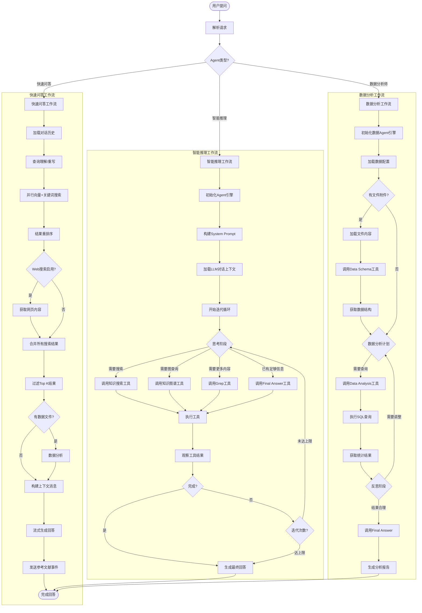

# Agent Flow 设计 - Python 实现大纲

基于 WeKnora Go 项目架构，使用 LangChain + LangGraph 实现的完整工作流设计。

---

## 一、整体架构概览

### 1.1 核心流程图



### 1.2 目录结构

```
weknora/
├── agent/
│   ├── __init__.py
│   ├── base.py              # 基础类
│   ├── factory.py           # Agent 工厂
│   ├── quick/
│   │   ├── __init__.py
│   │   ├── workflow.py      # 快速问答工作流
│   │   ├── nodes.py         # 快速问答节点
│   │   └── prompts.py       # 快速问答提示词
│   ├── smart/
│   │   ├── __init__.py
│   │   ├── workflow.py      # 智能推理工作流
│   │   ├── nodes.py         # 智能推理节点
│   │   ├── tools.py         # 智能推理工具
│   │   └── prompts.py       # 智能推理提示词
│   └── data/
│       ├── __init__.py
│       ├── workflow.py      # 数据分析工作流
│       ├── nodes.py         # 数据分析节点
│       ├── tools.py         # 数据分析工具
│       └── prompts.py       # 数据分析提示词
├── search/
│   ├── __init__.py
│   ├── vector.py            # 向量搜索
│   ├── keyword.py           # 关键词搜索
│   ├── rerank.py            # 结果重排序
│   └── web_search.py        # 网页搜索
├── chat/
│   ├── __init__.py
│   ├── history.py           # 对话历史管理
│   ├── context.py           # 上下文构建
│   └── streaming.py         # 流式输出
├── events/
│   ├── __init__.py
│   ├── bus.py               # 事件总线
│   └── types.py             # 事件类型定义
├── tracing/
│   ├── __init__.py
│   └── langfuse.py          # Langfuse 集成
└── config/
    └── settings.py          # 配置管理
```

---

## 二、快速问答工作流设计

### 2.1 工作流图 (agent/quick/workflow.py)

```
快速问答工作流
├── 1. 加载对话历史
├── 2. 查询理解/重写
├── 3. 并行搜索 (向量+关键词)
├── 4. 结果重排序
├── 5. 可选网页搜索
├── 6. 合并搜索结果
├── 7. 过滤 Top K
├── 8. 可选数据分析
├── 9. 构建上下文
├── 10. 流式生成回答
└── 11. 发送参考文献事件
```

### 2.2 核心模块设计

| 模块 | 职责 | 依赖 |
|------|------|------|
| `LoadHistoryNode` | 加载对话历史 | chat.history |
| `QueryUnderstandNode` | 查询理解和重写 | LLM |
| `VectorSearchNode` | 向量搜索 | search.vector |
| `KeywordSearchNode` | 关键词搜索 | search.keyword |
| `RerankNode` | 结果重排序 | search.rerank |
| `WebSearchNode` | 网页搜索 | search.web_search |
| `MergeResultsNode` | 合并搜索结果 | - |
| `FilterTopKNode` | 过滤 Top K 结果 | - |
| `DataAnalysisNode` | 数据文件分析 | agent.data |
| `BuildContextNode` | 构建上下文消息 | chat.context |
| `ChatCompletionNode` | 流式生成回答 | LLM |
| `EmitReferencesNode` | 发送参考文献事件 | events.bus |

### 2.3 LangGraph 图结构

- 入口点：`LoadHistory`
- 节点链：串行执行，部分节点并行
- 条件分支：Web 搜索、数据分析
- 结束点：`EmitReferences`

---

## 三、智能推理工作流设计

### 3.1 工作流图 (agent/smart/workflow.py)

```
智能推理工作流
├── 1. 初始化 Agent 引擎
├── 2. 构建 System Prompt
├── 3. 加载 LLM 对话上下文
├── 4. 迭代循环 (最多 N 轮)
│   ├── 4.1 Think 阶段
│   ├── 4.2 工具调用 (知识搜索/图查询/Grep)
│   ├── 4.3 Observe 阶段
│   └── 4.4 判断是否继续
└── 5. 生成最终回答
```

### 3.2 核心模块设计

| 模块 | 职责 | 依赖 |
|------|------|------|
| `InitAgentEngineNode` | 初始化 Agent 引擎 | - |
| `BuildSystemPromptNode` | 构建系统提示词 | agent.smart.prompts |
| `LoadLLMContextNode` | 加载对话上下文 | chat.history |
| `ThinkNode` | 思考阶段 (LLM 调用) | LLM |
| `KnowledgeSearchTool` | 知识搜索工具 | search.vector |
| `GraphQueryTool` | 知识图谱查询工具 | graph.query |
| `GrepChunksTool` | Grep 工具 | search.grep |
| `FinalAnswerTool` | 最终回答工具 | - |
| `ExecuteToolNode` | 执行工具调用 | agent.smart.tools |
| `ObserveNode` | 观察工具结果 | - |
| `CheckDoneNode` | 判断是否完成 | - |
| `GenerateFinalAnswerNode` | 生成最终回答 | LLM |

### 3.3 工具集定义

```python
# agent/smart/tools.py
- knowledge_search(query, knowledge_base_ids, top_k)
- graph_query(cypher, params)
- grep_chunks(keyword, knowledge_base_ids)
- final_answer(answer)
```

### 3.4 LangGraph 图结构

- 入口点：`InitAgentEngine`
- 循环节点：Think → ExecuteTool → Observe → CheckDone
- 条件边：继续循环 / 生成最终回答
- 结束点：`GenerateFinalAnswer`

---

## 四、数据分析工作流设计

### 4.1 工作流图 (agent/data/workflow.py)

```
数据分析工作流
├── 1. 初始化数据 Agent 引擎
├── 2. 加载数据配置
├── 3. 检查文件附件
│   ├── 3.1 加载文件内容
│   ├── 3.2 调用 Data Schema 工具
│   └── 3.3 获取数据结构
├── 4. 数据分析计划
├── 5. 迭代分析
│   ├── 5.1 调用 Data Analysis 工具
│   ├── 5.2 执行 SQL 查询
│   ├── 5.3 获取统计结果
│   └── 5.4 反思阶段 (结果合理/需要调整)
├── 6. 生成分析报告
└── 7. 完成
```

### 4.2 核心模块设计

| 模块 | 职责 | 依赖 |
|------|------|------|
| `InitDataEngineNode` | 初始化数据引擎 | - |
| `LoadDataConfigNode` | 加载数据配置 | config |
| `CheckAttachmentNode` | 检查文件附件 | - |
| `LoadFileContentNode` | 加载文件内容 | file.parser |
| `DataSchemaTool` | 获取数据结构 | data.schema |
| `AnalyzeDataNode` | 制定分析计划 | LLM |
| `DataAnalysisTool` | 数据分析工具 | data.analysis |
| `ExecuteSQLNode` | 执行 SQL 查询 | data.sql |
| `GetResultsNode` | 获取统计结果 | - |
| `ReflectNode` | 反思阶段 | LLM |
| `GenerateReportNode` | 生成分析报告 | LLM |

### 4.3 工具集定义

```python
# agent/data/tools.py
- data_schema(file_id)
- data_analysis(query, data_source)
- execute_sql(sql, data_source)
- final_answer(answer)
```

### 4.4 LangGraph 图结构

- 入口点：`InitDataEngine`
- 条件分支：检查文件附件
- 循环节点：AnalyzeData → ExecuteSQL → GetResults → Reflect
- 结束点：`GenerateReport`

---

## 五、Agent 工厂设计

### 5.1 工厂模块 (agent/factory.py)

职责：根据 Agent 类型创建对应的工作流

| 方法 | 说明 |
|------|------|
| `create_agent(agent_type, config)` | 创建 Agent 实例 |
| `get_agent_types()` | 获取支持的 Agent 类型列表 |

### 5.2 Agent 类型枚举

```python
from enum import Enum

class AgentType(str, Enum):
    QUICK_ANSWER = "quick_answer"      # 快速问答
    SMART_REASONING = "smart_reasoning" # 智能推理
    DATA_ANALYST = "data_analyst"       # 数据分析师
```

---

## 六、搜索模块设计

### 6.1 搜索模块 (search/)

| 模块 | 职责 |
|------|------|
| `vector.py` | 向量搜索 (PGVector, Milvus, etc.) |
| `keyword.py` | 关键词搜索 (Elasticsearch, etc.) |
| `rerank.py` | 结果重排序 (CrossEncoder, etc.) |
| `web_search.py` | 网页搜索 (Tavily, Bing, etc.) |
| `grep.py` | 分块 Grep 搜索 |

### 6.2 并行搜索设计

- 使用 `asyncio.gather` 并行执行向量和关键词搜索
- 统一结果格式，方便后续处理

---

## 七、对话管理模块设计

### 7.1 对话历史 (chat/history.py)

| 功能 | 说明 |
|------|------|
| 加载历史对话 | 从数据库或缓存获取 |
| 管理上下文窗口 | 自动合并过长的历史 |
| 添加入口消息 | 记录用户和 Agent 消息 |

### 7.2 上下文构建 (chat/context.py)

| 功能 | 说明 |
|------|------|
| 构建系统提示词 | 包含知识库信息、工具信息 |
| 格式化搜索结果 | 引用格式统一 |
| 构建消息列表 | 系统提示 + 历史 + 当前对话 |

### 7.3 流式输出 (chat/streaming.py)

| 功能 | 说明 |
|------|------|
| 流式调用 LLM | 实时输出 |
| 发射事件 | 通过 EventBus 向外通知 |
| 累积完整内容 | 保存最终结果 |

---

## 八、事件驱动架构

### 8.1 事件总线 (events/bus.py)

| 功能 | 说明 |
|------|------|
| 订阅事件 | 注册回调函数 |
| 发射事件 | 异步发送事件 |
| 取消订阅 | 移除回调 |

### 8.2 事件类型 (events/types.py)

```python
from enum import Enum

class EventType(str, Enum):
    # 快速问答
    QUICK_ANSWER_START = "quick_answer_start"
    QUICK_ANSWER_CHUNK = "quick_answer_chunk"
    QUICK_ANSWER_REFERENCES = "quick_answer_references"
    QUICK_ANSWER_COMPLETE = "quick_answer_complete"
    
    # 智能推理
    SMART_THINK = "smart_think"
    SMART_TOOL_CALL = "smart_tool_call"
    SMART_TOOL_RESULT = "smart_tool_result"
    SMART_FINAL_ANSWER = "smart_final_answer"
    SMART_COMPLETE = "smart_complete"
    
    # 数据分析
    DATA_SCHEMA = "data_schema"
    DATA_SQL_EXECUTE = "data_sql_execute"
    DATA_RESULT = "data_result"
    DATA_REPORT = "data_report"
    DATA_COMPLETE = "data_complete"
    
    # 通用
    ERROR = "error"
```

---

## 九、可观测性设计

### 9.1 Langfuse 集成 (tracing/langfuse.py)

| 功能 | 说明 |
|------|------|
| 创建 Trace | 每次对话创建一个 Trace |
| 追踪节点执行 | 每个节点创建一个 Span |
| 记录工具调用 | 记录工具调用的输入输出 |
| 记录 LLM 调用 | 记录 LLM 调用详情 |

---

## 十、配置管理

### 10.1 配置模块 (config/settings.py)

| 配置项 | 说明 |
|--------|------|
| LLM 配置 | 模型、温度、最大 Token |
| 搜索配置 | Top K、重排序启用、Web 搜索 |
| Agent 配置 | 最大迭代次数、并行工具 |
| 追踪配置 | Langfuse 启用、API Key |

---

## 十一、技术栈汇总

| 层级 | 技术选择 |
|------|---------|
| Agent 框架 | LangGraph |
| LLM 集成 | LangChain |
| 工具集成 | LangChain Tools |
| 向量搜索 | LangChain Vector Stores |
| 异步框架 | AsyncIO |
| Web 框架 | FastAPI |
| 追踪 | Langfuse / LangSmith |

---

## 十二、与 Go 版本的对比

| 特性 | WeKnora Go 版本 | Python + LangGraph 版本 |
|------|----------------|------------------------|
| 快速问答 | 自定义管道 | LangGraph 工作流 |
| 智能推理 | AgentEngine ReAct 循环 | LangGraph 状态图 |
| 数据分析 | DataAgent 引擎 | LangGraph 工作流 |
| 工具执行 | ToolRegistry | LangChain Tools |
| 事件驱动 | EventBus | EventBus (保持相同模式) |
| 流式输出 | 自定义流 | LangChain Streaming |
| 追踪 | Langfuse | Langfuse |

---

## 十三、关键设计决策

1. **三种工作流独立实现** - 快速问答、智能推理、数据分析各自独立，便于维护和扩展
2. **LangGraph 统一协调** - 使用 LangGraph 管理所有工作流的状态和流转
3. **事件驱动架构** - 通过 EventBus 与外部系统解耦，支持实时通知
4. **模块化工具设计** - 工具独立定义，可在不同工作流间复用
5. **可观测性优先** - 完整集成 Langfuse，方便调试和监控

---

## 十四、下一步计划

1. 实现基础类和接口定义
2. 实现快速问答工作流（相对简单，优先实现）
3. 实现智能推理工作流
4. 实现数据分析工作流
5. 实现 Agent 工厂和统一入口
6. 集成 Langfuse 追踪
7. 编写测试用例
8. FastAPI 集成
